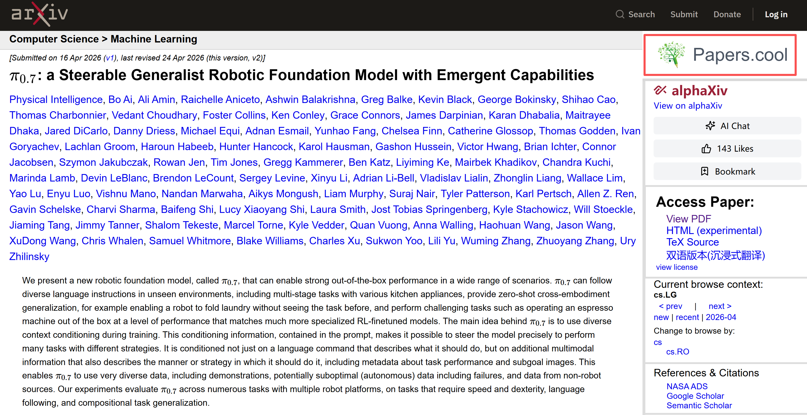
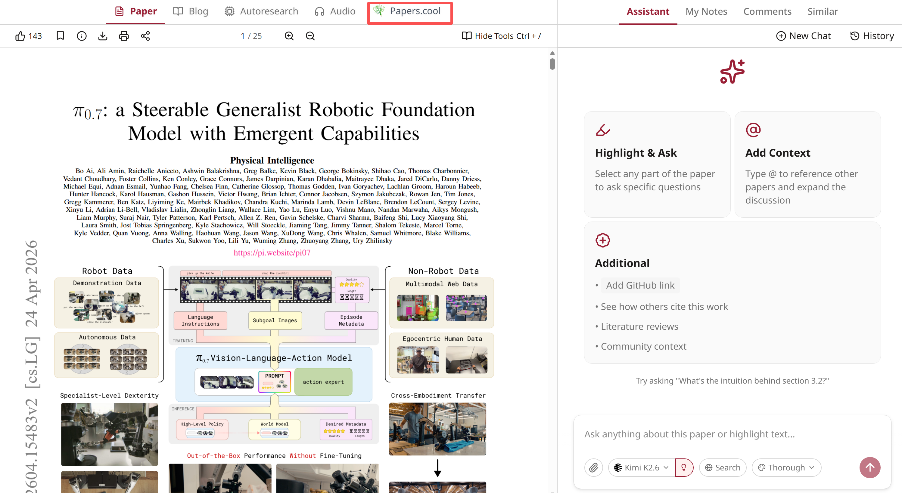

# arXiv Papers.cool Bridge

<p>
  
</p>

A Tampermonkey userscript that adds a natural Papers.cool entry to arXiv and alphaXiv paper pages.

## Features

- Adds a Papers.cool entry above the alphaXiv block on `arxiv.org/abs/*`.
- Adds a Papers.cool entry next to `Audio` on `alphaxiv.org/abs/*`.
- Opens Papers.cool in a new tab without replacing the current paper page.
- Uses the official Papers.cool favicon for a native-looking entry.

## Install

Install with Tampermonkey or another compatible userscript manager:

```text
https://raw.githubusercontent.com/Peaceful-World-X/arxiv-papers-cool-bridge/main/arxiv-papers-cool-bridge.user.js
```

## Screenshots

### arXiv

Papers.cool is shown in the right sidebar, above the alphaXiv block.



### alphaXiv

Papers.cool is shown in the top navigation, next to Audio.



## Supported Sites

- `https://arxiv.org/abs/*`
- `https://alphaxiv.org/abs/*`
- `https://www.alphaxiv.org/abs/*`

## License

MIT
